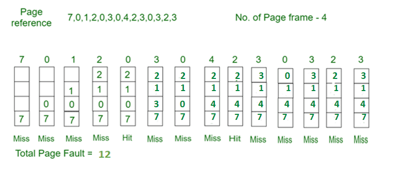

# Page Replacement Algorithms
* First In First Out (FIFO)
* Optimal Page replacement
* Least Recently Used
* Most Recently Used (MRU)

### First In First Out (FIFO)
* This is the simplest page replacement algorithm.
* In this algorithm, the operating system keeps track of all pages in the memory in a queue, the oldest page is in the front of the queue.
* When a page needs to be replaced page in the front of the queue is selected for removal.

### Optimal Page replacement
* In this algorithm, pages are replaced which would not be used for the longest duration of time in the future.

### Least Recently Used
* In this algorithm, the page which has been used least is replaced.

### Most Recently Used (MRU)
* In this algorithm, the page which has been used most is replaced.

