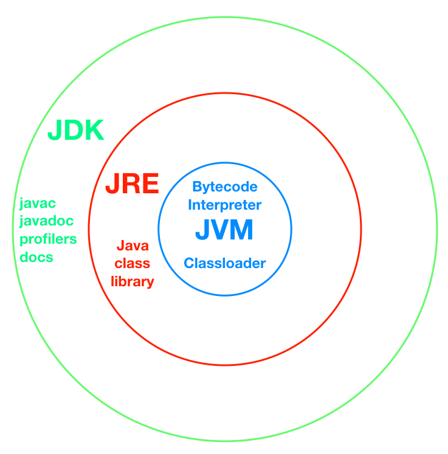

**java program execution**
* [java code: .java] -> compilation -> [byte code: .class] -> interpretation -> [machine code: 0101]

**Basic terms**
* JDK: Java Development Kit
* JRE: Java Runtime Environment
* JVM: Java Virtual Machine

