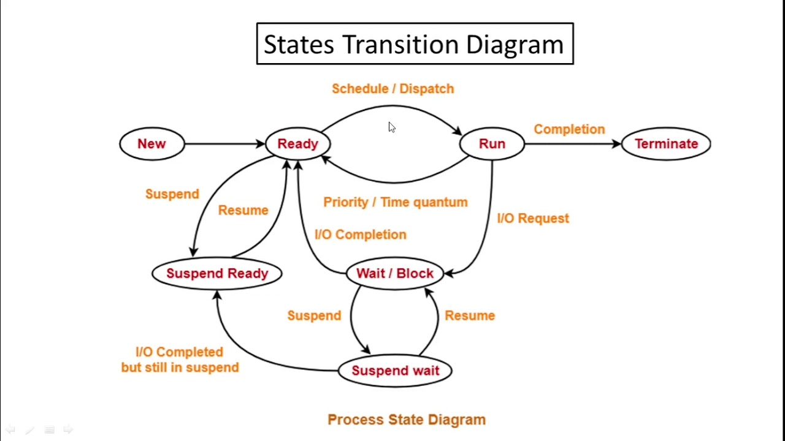

# Process

## Process state
- new
- ready
- running
- waiting
- terminated

## Process transition diagram

### Process
- System calls involved in process
- OS treats different process as different entity
- Different process have different copies of data, files, code
- Context switching is slower
- Blocking a process will not block any other process
- Process are independent of each other

### Thread
- No system call involved in thread
- All user level threads treated as single task for OS
- Thread share same copy of code and data
- Context switching is faster
- Blocking a thread will block entire process
- Intradependent of each other

**User level thread**
- User level threads are managed by user level library
- User level threads are typically fast
- Context switching is fast
- If one user level thread perform blocking operation, then entire process gets blocked

**Kernal level thread**
- Kernal level threads are managed by OS
- Kernal level threads are typically slow
- Context switching is slow
- If one kernal level thread is blockd, then it does not affect other kernal level threads

