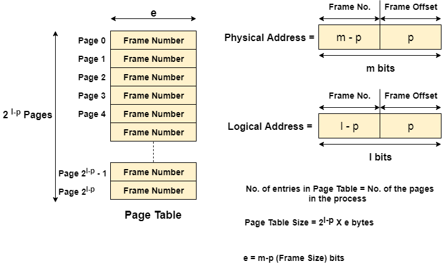

# General Topics

**CPU is byte addressable**

**Logical Address (or Virtual Address)**
* Logical address space
* Each process has its own logical address space.

**Physical Adderss (or Actual Address)**
* Physical address space

**MMU(Memory Management Unit)**
* The run time mapping between Virtual address and Physical Address is done by a hardware device known as MMU.
* In memory management, the Operating System will handle the processes and move the processes between disk and memory for execution . It keeps track of available and used memory.

**Page Table**
* A data structure used to map logical address to physical address.
* Each process has its own page table.
* Page table of a process will be stored in main memory when the process is going to executed.

## Virtual Memory (some part written in hard notes)
* Virtual Memory is a storage allocation scheme in which secondary memory can be addressed as though it were part of the main memory.
* When cpu demands a page and it is not available in main memory then it is known page fault.
* To resolve this the needed page from swap area is replaced with not needed page in main memory.

