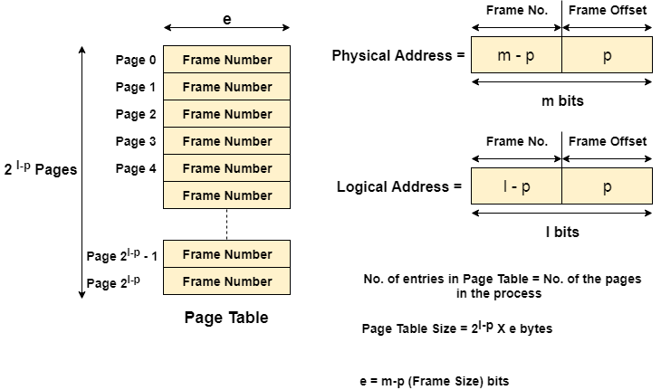

# General Topics

**CPU is byte addressable**

**Logical Address (or Virtual Address)**
* Logical address space
* Each process has its own logical address space.

**Physical Adderss (or Actual Address)**
* Physical address space

**MMU(Memory Management Unit)**
* The run time mapping between Virtual address and Physical Address is done by a hardware device known as MMU.
* In memory management, the Operating System will handle the processes and move the processes between disk and memory for execution . It keeps track of available and used memory.

**Page Table**
* A data structure used to map logical address to physical address.

