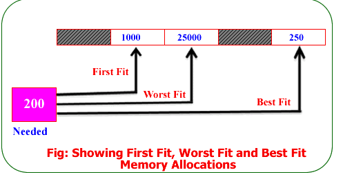
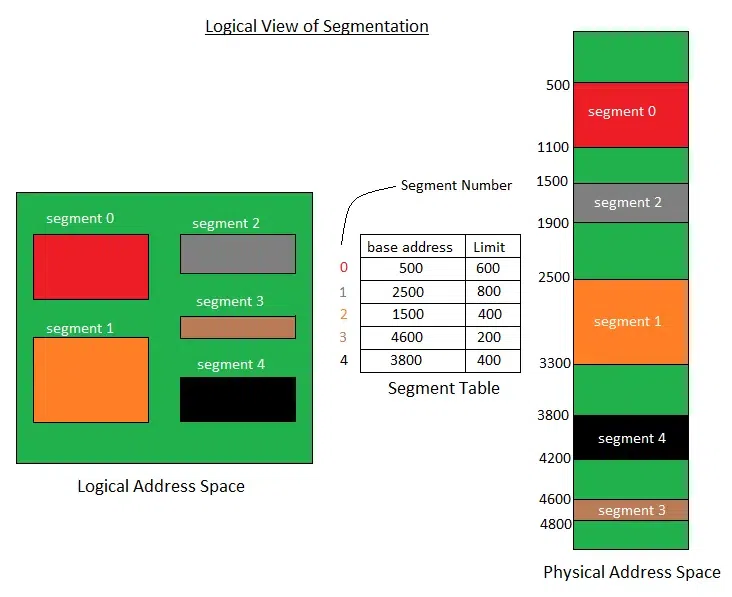

# Memory Allocation Techniques
* This is used to store the data and manage the processes in the main memory.
* Main memory is divided into non-overlapping memory regions called partitions.

***Flow***
* Contiguous
    * Fixed (or static) partition scheme
    * Variable (or dynamic) partition scheme
* Non-contiguous
    * Paging
    * Multilevel paging
    * Internal paging
    * Segmentation
    * Segmented paging

## The main memory can be broadly allocated in two ways
1. Contiguous memory allocation
2. Non-Contiguous memory allocation 

### 1. Contiguous memory allocation
In this technique we assign contiguous memory blocks to each task.

***Advantage***
* Easy to Implement (becasue not using pointers or any indexes)
* Excellent read performance (because all the data is stored together in contiguous manner)

***Diadvantage***
* Disk will become fragmented (internal and external)
* major problem - external fragmentation
* Difficult to grow file

***Types of contiguous memory allocatino***
1. Fixed (or static) partition scheme
2. Variable (os dynamic) partition scheme.

#### 1.1 Fixed (or static) partition scheme
In this technique main memory is divided into fixed number of partitions.
 
Each partition is typically allocated at system boot time
 
Number of partitions is fixed but size of each partitions is not fixed
 

***for example:-***
* memory block -> [OS] [4kb] [8kb] [8kb] [16kb]
* memroy block -> [OS] [8kb] [8kb] [8kb] [8kb]
 
Here both memory blocks come under fixed partitions as number of partitions are same i.e. 4 but size of each partitions may not be same.

One partitions is allocated to one process only.
No process can occupy more than one partitions.
(size of each process should be smaller or equal to size of partition)

***Flaws***
* Internal fragementation
* Limit in process size (32kb process can't be allocated to partitions of 16kb size if there is not 32kb partition)
* Limitation on degree of multiprogramming (this things says that main memory should contain maximum number of processes for efficient use of memory, but no. of partitions is fixed so no. of processes in main memory will be fixed)

#### 1.2 Variable (os dynamic) partition scheme.
* In this partitioning, partitions are made during run-time according to the process’s need instead of partitioning during system configuration.
* Size of the partitions will be equal to incoming process. (to avoid internal fregmentation and to ensure efficient utlization of RAM)
* No. of partitions is not fixed, it depends on no. of incomming processes and the main memory's size.

***for example:-***
* memory block -> [OS] [2mb] [4mb] [2mb] [8mb] [empty space of RAM]
* memory block -> [OS] [8mb] [16mb] [2mb] [empty space of RAM]

***Advantages***
* No internal fregmentation.
* No limitation on no. of processes.
* No limitation of process size.

***Disadvantages***
* A hole is created when a process is executed and frees his space from RAM.
* External fregmentation (due to holes).
* Complex allocation and deallocation (because there will be many process and holes in the main memory).

#### Memory allocation methods in contiguous memory allocation
These are the methods of memory allocation used to allocate memory to processes in holes.
 
or we can say methods to fit the processes in holes.
* First fit
* Best fit
* Worst fit
* Next fit
    * Next fit is same as first fit but first-fit searches for holes from starting but next-fit searches for holes from the hole which was recently occupied.
    * It uses a pointer to track recently occupied hole.

### 2. Non-contiguous memory allocation
* Also known as dynamic or linked allocation.
* This memory allocation technique breaks the process in parts and allocates different memory blocks to different parts of a process.
* This helps in overcomming internal fregmentation.
* These pointers are used by the operating system to keep track of the memory blocks allocated to the process and to locate them during the execution of the process.

***Types of Non-contiguous memory allocation***
* Paging
* Multilevel paging
* Inverted paging
* Segmentation
* Segmented paging

#### Paging
* No external fregmentation.
* Internal fregmentation may occure (if last page of the process is less than page or frame size)

#### Multilevel paging

#### Inverted paging

#### Segmentation
* In segmentation, a process is divided into segments.
* These segments are not equal in size.
* External fregmentation occurs.
* No internal fragmentation.

#### Segmented paging

