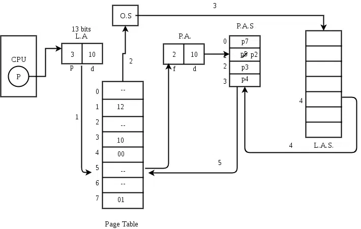

## Virtual Memory (some part written in hard notes)
* Virtual Memory is a storage allocation scheme in which secondary memory can be addressed as though it were part of the main memory.
* When cpu demands a page and it is not available in main memory then it is known page fault.
* To resolve this the needed page from swap area is replaced with not needed page in main memory.

### Demand Paging
* This concept says don't load any page in main memory until it is needed.
* The process of loading the page into memory on demand (whenever a page fault occurs) is known as ***demand paging***.
* In this process, some pages of all the processes are preloaded in main memory to maximum memory utlization.
* Demand paging is a technique used in virtual memory systems where pages enter main memory only when requested or needed by the CPU.
* In demand paging, the operating system loads only the necessary pages of a program into memory at runtime, instead of loading the entire program into memory at the start.

**Page fault or Page miss**
* A page fault occurred when the program needed to access a page that is not currently in main memory.
* Before enabling the program to access a page that is required, the operating system must bring it into memory from secondary storage (such a hard drive) in order to handle a page fault.



```
// Page fault service time
Let Main memory access time is: m
Page fault service time is: s
Page fault rate is : p
Then, Effective memory access time = (p*s) + (1-p)*m
```

**Swapping**
* Swap in: sending demanded page from secondary memory to main memory.
* Swap out: sending unneeded page from main memory to secondary memory.


**Thrashing**
* A situation when system is spending most of the time in servicing page faults (swapping), than executing the actual process.

**Pure demand paging**
* Similar to demand paging but in pure demand paging no page of any process is preloaded in main memory.
* But, in demand paging some page of every process is preloaded in main memory.
* The page will load in main memory only when it is needed.


